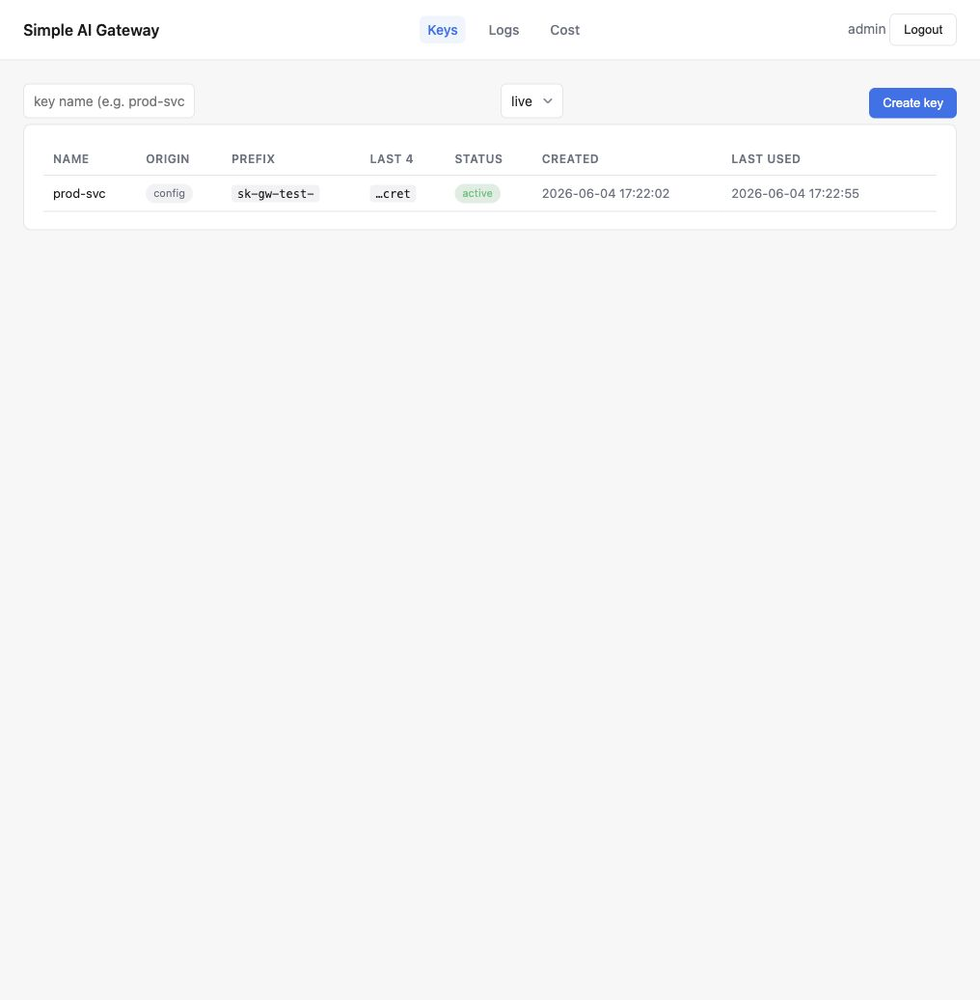
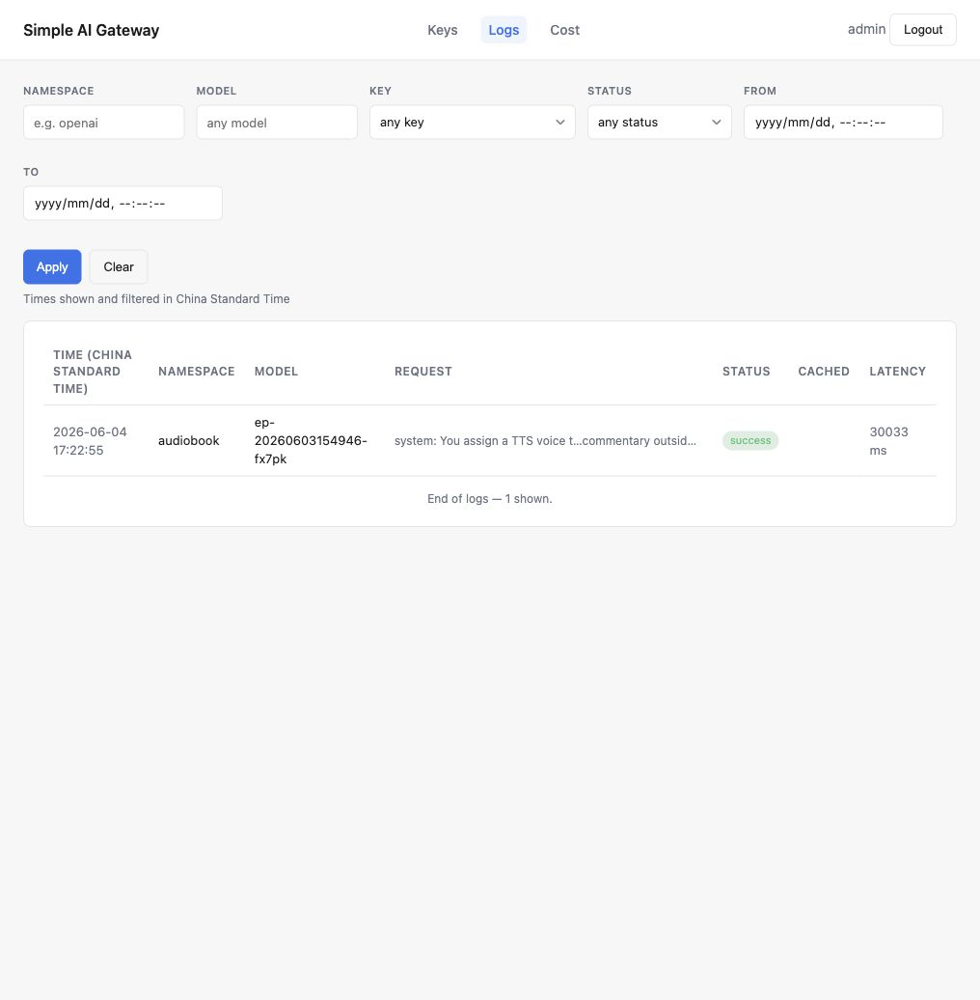
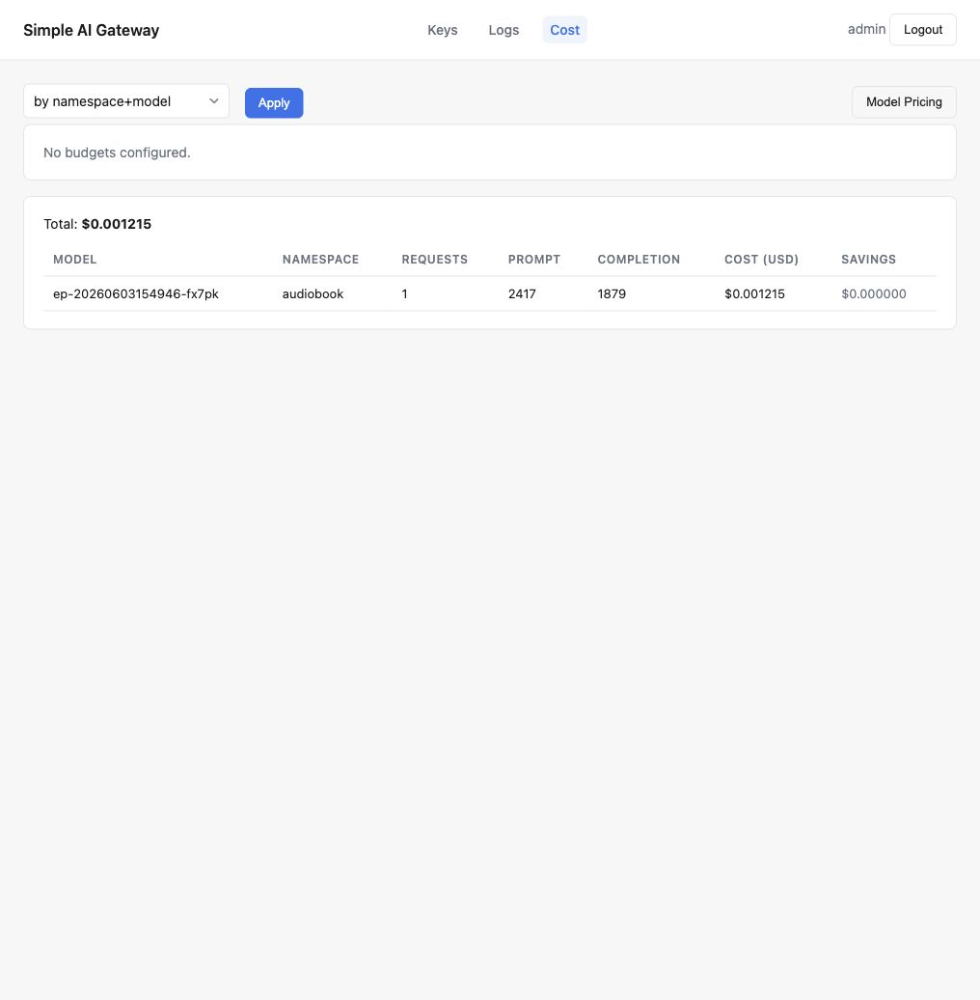
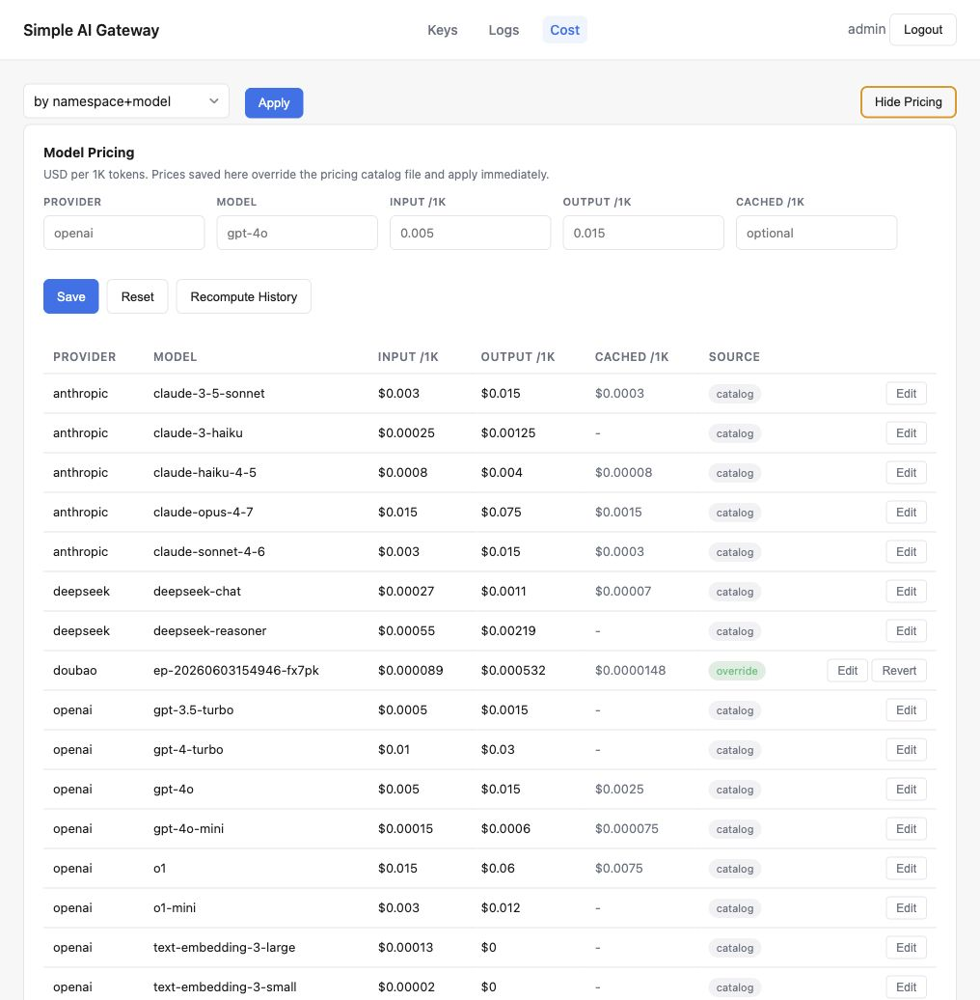

# 管理界面

simple-ai-gateway 内置一个轻量级 Admin UI,随网关一起暴露在 `/ui/` 路径下。它适合日常管理和排障:创建/撤销 Gateway API Key、查看请求日志、按维度统计成本、维护模型价格。

UI 背后调用的是同一组 [Admin API](./admin-api.md)。需要批量操作或接入自动化脚本时,优先使用 Admin API;需要人工查看和临时处理时,使用 Admin UI 更方便。

## 入口与登录

浏览器打开:

```text
http://localhost:8080/ui/
```

UI 使用 admin 账号密码登录,登录成功后在浏览器本地保存 12 小时有效的 Admin JWT。第一次使用前,需要先用 root token 创建 admin 账号:

```sh
curl -X POST http://localhost:8080/admin/admins \
  -H "Authorization: Bearer $GATEWAY_ROOT_TOKEN" \
  -H "Content-Type: application/json" \
  -d '{"username":"admin","password":"admin123"}'
```

> 生产环境请把 `/ui/` 放在 HTTPS 或可信反向代理之后,并避免在共享浏览器里长期保留登录态。

## API Key 管理

Keys 页用于创建、查看和撤销 Gateway API Key。



主要行为:

- 创建 Key 时选择 `live` 或 `test`,它只影响明文前缀(`sk-gw-live-` / `sk-gw-test-`),方便肉眼区分环境。
- 新建 Key 的明文 secret 只显示一次。离开页面或刷新后,只能看到 prefix、last4 和状态。
- `origin: config` 的 Key 由 YAML 配置托管,不能在 UI 里撤销;需要修改配置文件后让网关热重载。
- `origin: admin` 且 `active` 的 Key 可以直接在 UI 里撤销,撤销后代理请求会被拒绝。

## 请求日志

Logs 页用于检索代理请求记录,适合排查上游状态、延迟、缓存命中和请求摘要。



可以按以下条件过滤:

| 过滤项 | 说明 |
| --- | --- |
| Namespace | URL 中 `/v1/{namespace}/...` 的 namespace。 |
| Model | 请求中解析到的模型名。 |
| Key | Gateway API Key。 |
| Status | `success`、`upstream_error`、`gateway_error`、`timeout`。 |
| From / To | 本地时区的时间范围,提交时会转换为 UTC 时间戳。 |

日志列表会随滚动自动加载更多记录。点击某条日志会在新标签页打开详情,详情里可以查看请求/响应 body 摘要、token 用量、耗时、上游尝试记录和元数据。

## 成本统计

Cost 页展示 token 用量和美元成本汇总,并同时显示当前预算状态。



支持的聚合维度:

- `by namespace+model`
- `by day`
- `by namespace+model+day`
- `by key`

成本来自请求日志里记录的 token 数和模型价格。预算配置来自 YAML 的 `budgets[]`,如果没有配置预算,页面会显示 `No budgets configured.`。

## 模型价格维护

Cost 页右上角的 `Model Pricing` 会展开模型价格维护面板。



模型价格以 USD / 1K tokens 计:

- `openrouter` 表示启动时从 OpenRouter 拉取的基础价格,以完整 API ID 展示(如 `openai/gpt-6-luna`),provider 为 `*`。
- `catalog` 表示来自 `pricing-catalog.json` 的配置覆盖价格。
- `override` 表示通过 UI 或 Admin API 写入的覆盖价格,会立即用于后续成本计算。
- `Edit` 会把当前行填入表单,保存后成为 override。
- `Revert` 会删除该模型的 override,回到文件或 OpenRouter 基础价格。
- `Recompute History` 会用当前价格重新计算历史日志中的成本和节省金额。

`Recompute History` 会覆盖已落库的历史成本字段,适合修正价格后回填报表;执行前建议先限定时间范围并确认当前价格无误。
